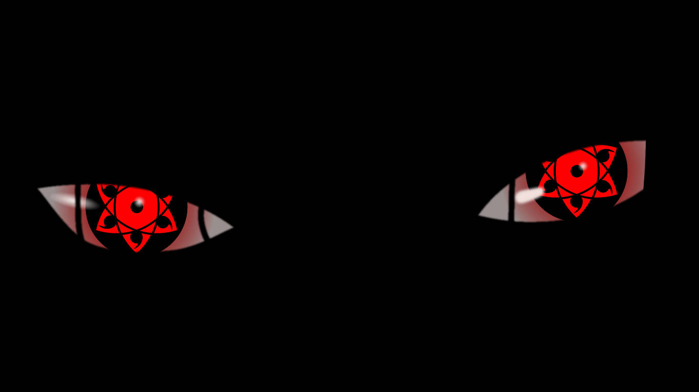
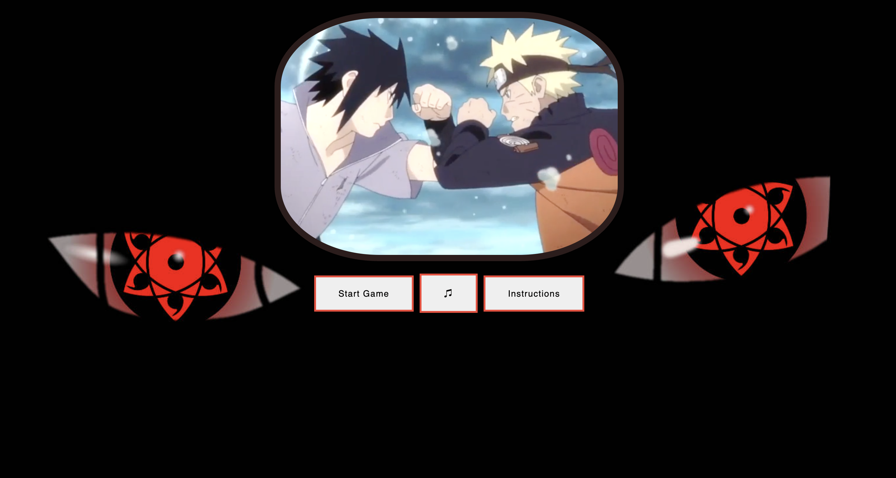
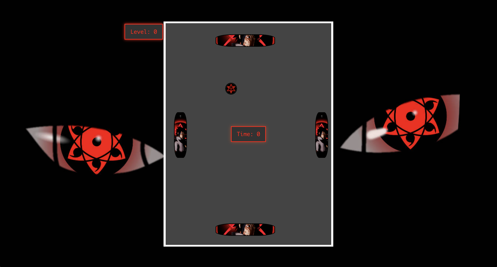

# The Sharingan

- ## Introduction
- ##  Instructions
- ##  Used technologies
- ## Demo

## Introduction 

**The game is called The Sharingan. Your goal is to survive until level 10 to achieve victory. As you may know, the Sharingan does not activate automatically at birth. It only awakens when the heir of the Kekkei Genkai experiences extreme stress or emotional trauma. That’s why surviving the game is essential to unlocking it. Are you ready?!**

## Instructions for the Game

**Objective**
- Survive as long as possible while controlling the ball.
- The game gets harder as you progress!

**How to Play**

- Use the arrow keys or "a", "s", "d" "w" to move the blocks.

**Winning & Losing**

- If you reach Level 10, you win the game! 🎉
- you have 01:40 to reach it
- if the ball touch any border you lose 👎
- Stay focused and react quickly to survive!

**Additional Notes**

- The game music will play continuously in the background.
- If you lose, you will be redirected to the Game Over screen.
- Try again and improve your survival time!

## Used Technologies

- **HTML**
- **Css**
- **JavaScript**

### In the follow link you can find the Demo 
[The Sharingan](https://dvdrepetto.github.io/game-proyect-module1/index.html)

